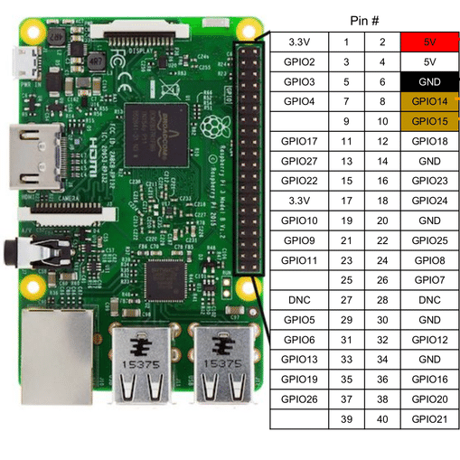
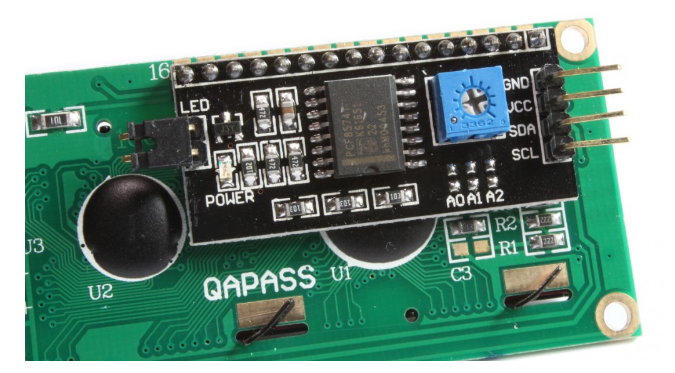
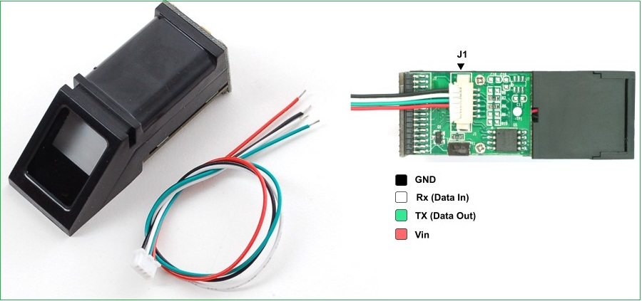
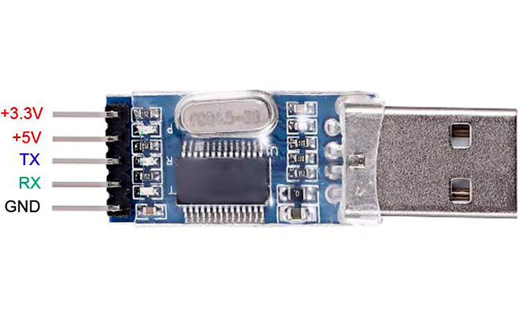

# TAAMS HARDWARE USING PYTHON

## Attendance System using Raspberry Pi, Fingerprint Sensor, External Keyboard and LCD Display

This Python code is designed to take attendance using a Raspberry Pi, a fingerprint sensor, an external keyboard, and an LCD display. The system is intended for use in a classroom or office setting.

## Hardware Requirements

To use this code, you will need the following hardware:

- Raspberry Pi (any model should work)
- LoRa Module
- Fingerprint Sensor (such as the R305 or GT-511C3)
- External Keyboard (any USB keyboard should work)
- LCD Display (such as the 16x2 or 20x4 character displays) with i2C configured
- USB to TTL adapters


<br>
<br>

<br>
<br>

<br>
<br>


## Software Requirements

In addition to the hardware listed above, you will also need the following software installed on your Raspberry Pi:

- Raspbian Operating System
- Python 2.x/3.x
- RPLCD library for Python (if using an LCD display)
- pyfingerprint library for Python (if using a fingerprint sensor)

## Installation

### Pre Setup

Since the project is going to be run <b>HEADLESS</b> (without hdmi screen), we have to configure SSH.

### SSH

Running a Raspberry Pi (Raspi) headless means that you will be accessing and controlling your Raspi remotely, without the need for a monitor, keyboard, or mouse. Here are the steps to do so:

- Flash the Raspi OS onto an SD card, using a tool like BalenaEtcher or Raspberry Pi Imager.

- Once the flashing process is complete, create an empty file named "ssh" in the boot partition of the SD card. This will enable the SSH service on the Raspi, allowing you to connect to it remotely.

- If you want to connect to the Raspi via Wi-Fi, create a file named "wpa_supplicant.conf" in the boot partition of the SD card, and add the following lines to it:

```makefile
country=<your 2-letter country code>
ctrl_interface=DIR=/var/run/wpa_supplicant GROUP=netdev
update_config=1

network={
     ssid="<your Wi-Fi network name>"
     psk="<your Wi-Fi network password>"
}
```

- Replace <your 2-letter country code> with the ISO 3166-1 alpha-2 code of your country, <your Wi-Fi network name> with the SSID of your Wi-Fi network, and <your Wi-Fi network password> with the password for your Wi-Fi network.

- Insert the SD card into your Raspi, and connect it to your home network using an Ethernet cable or Wi-Fi.

- Power on the Raspi. Wait for a few minutes for it to boot up and connect to your home network.

- Find the IP address of your Raspi. You can do this by logging into your router's admin panel, and looking for a device named "raspberrypi" <br>
  OR
- Open the terminal on your computer, and type the following command to find the IP address of your Raspberry Pi:

```css
arp -a
```

- Look for an IP address that starts with "192.168." and ends with ".1". This is usually the IP address of your Raspberry Pi. Take note of this IP address.

- Connect to your Raspi using SSH. On a Linux or macOS machine, open a terminal and type:

```bash
ssh pi@<raspi IP address>
```

- Replace <raspi IP address> with the IP address of your Raspi. When prompted, enter the default username and password, which are "pi" and "raspberry", respectively.

- You should now be connected to your Raspi via SSH, and can control it using terminal commands.

### LCD display Integration

#### I2C

We need the below two tools for working with I2C. So install it by running the following command in the RPI terminal.

```bash
sudo apt-get install python-smbus i2c-tools
```

#### Enable I2C

```bash
sudo raspi-config
```

The above command opens the Raspberry Pi configuration in the terminal. Under ‘Interfacing Options’, activate I2C.

```bash
sudo vi /etc/modules
```

Add the following two lines at the end of the file and save it.

```shell
i2c-bcm2708
i2c-dev
```

Then install the python library

```bash
sudo pip install RPLCD
```

Then restart Raspberry Pi.

```bash
sudo reboot
```

### FingerPrint Integration

Just run

```bash
sudo pip install pyfingerprint
```

## Setup

- Connect the LoRa as usual using a USB-TTL converter and make its the <b>first thing</b> you connect to the RaspBerry Pi.

- The Raspberry Pi has two pins (pin 8 / GPIO14 and pin 10 / GPIO 15), but they work with 3.3V. Since there are different fingerprint sensors, which do not all work with 3.3V, a <b>USB TTL converter</b> is recommended. Some models can be used with both 3.3V and 5V voltage. These are particularly suitable (also in connection with an Arduino).

- Connect the Fingerprint sensor to the USB-TTL in the following manner

  - Red: Depending on the accepted voltage of the sensor (3.3V or 5V).
  - White: RXD
  - Green: TXD
  - Black: GND

- Connect the external keyboard to one of the USB ports on the Raspberry Pi. Let this be the last thing you connect to the Raspberry Pi USB Port

- If using an I2C LCD display, connect it to the Raspberry Pi in the following manner

  - SDA: pin 3
  - SCL: pin 5
  - GND: pin 20
  - VCC: pin 2

- Connect the buttons in the following manner
  - upButton: pin 11
  - downButton: pin 13
  - okButton: pin 15
  - cancelButton: pin 16

## Usage (Run upon startup)

- create the `attendance.py` file and open it using <b>nano</b> editor

```bash
touch attendance.py
nano attendance.py
```

- copy the contents of `attendance.py` to the nano editor, using <b>Ctrl V</b>

- save by pressing <b>Ctrl X, Enter</b>

- then to run it on startup, we use crontab which is a background (daemon) process that lets you execute scripts at specific times. It's essential to Python and Raspberry Pi.

```bash
sudo crontab -e
```

- This will brings up a crontab window.

- Now, enter the line:

```bash
@reboot python /home/pi/attendance.py >/home/pi/cronlog 2>&1
```

What this does is rather than executing the launcher script at a specific time, it will execute it once upon startup.
<br>
Reboot and See If It Works. Unplug the power or just type in:

```bash
sudo reboot
```

Wait for startup and see if your script automatically launches.

If it doesn't work, check out the log file:

```bash
cat cronlog
```

This will show you any errors that you might have.

You'll want to have an easy way to exit the code, so that you don't get stuck in an endless buggy loop.

In a standard Python script, you can always hit <b>Ctrl C</b>, which will exit.

## Troubleshooting

If you encounter any issues while using the attendance system, try the following troubleshooting steps:

- Make sure all hardware is connected properly and powered on.

- Ensure that the fingerprint sensor is properly calibrated and has a good image of each user's fingerprint.

- Check that the correct libraries are installed and imported in the code.

- Double-check the wiring diagrams for your hardware to ensure that everything is connected correctly.

## Conclusion

With this code and the necessary hardware, you can easily create an attendance system using a Raspberry Pi, a fingerprint sensor, an external keyboard, and an LCD display. This system is simple to set up and use, making it ideal for classrooms and offices.
